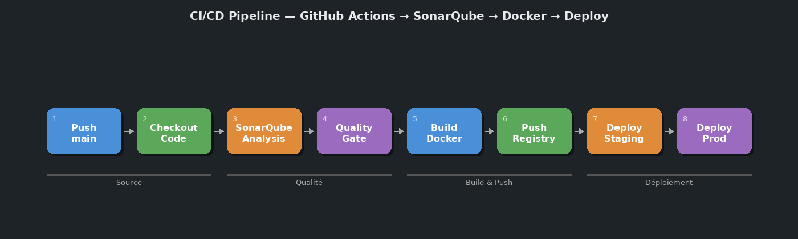

# Questionnaire

## Question 1

Les définitions des pipelines CI/CD se trouvent dans le dossier `.github/workflows/` à la racine du dépôt. Dans le cas de fluffy-octo-sniffle, le fichier est `.github/workflows/build.yaml`.

## Question 2

Le schéma au format PNG est inclus ci-dessous et disponible à la racine du dossier sous le nom `schema_pipeline.png`.



Étapes essentielles du pipeline observé :
1. **Déclencheur** : push sur la branche `main`
2. **Checkout** : récupération du code source (`actions/checkout`)
3. **Setup Python** : configuration de l'environnement Python
4. **Dépendances** : installation via `pip install -r requirements.txt`
5. **Tests & couverture** : exécution de `pytest --cov . --cov-report xml`
6. **Analyse qualité** : envoi vers SonarQube Cloud (`sonarqube-scan-action`)

## Question 3

La reproduction à l'identique avec Jenkins est **partiellement possible** mais plusieurs informations sont manquantes ou incompatibles :

- **`matrix.python` non définie** : le workflow référence `${{ matrix.python }}` dans `setup-python` mais aucune stratégie `matrix` n'est déclarée dans le job. La version Python n'est donc jamais réellement injectée — c'est un bug dans le workflow d'origine. Il est impossible de reproduire fidèlement un comportement indéfini.
- **`secrets.SONAR_TOKEN`** : le token SonarQube est stocké en secret GitHub. Sans accès à ce secret, la reproduction dans Jenkins nécessite de reconfigurer la credential dans Jenkins Credentials Manager.
- **`actions/checkout@v6` et `actions/setup-python@v6`** : ces actions GitHub n'existent pas dans Jenkins. Il faut les remplacer par des étapes shell équivalentes.
- **SonarQube Cloud vs self-hosted** : le workflow cible SonarQube Cloud. Dans Jenkins, on ciblera une instance locale.
- **Runner GitHub (`ubuntu-latest`)** : à remplacer par un agent Jenkins équivalent.

## Question 4

Critiques du fichier `compose.yaml` de fluffy-octo-sniffle :

- **Tag `:latest` non déterministe** : `sonarqube:latest` et `sonarsource/sonar-scanner-cli` sans version fixe rendent les builds non reproductibles.
- **Token en clair dans le fichier** : `SONAR_TOKEN=sqa_31c555e7...` est un secret exposé directement dans le fichier versionné — faille de sécurité critique.
- **Absence de réseau nommé explicite** : les services communiquent via le réseau par défaut de Compose, sans déclaration explicite.
- **Absence de `healthcheck`** : aucun contrôle de santé sur SonarQube ; le scanner CLI peut démarrer avant que SonarQube soit prêt.
- **Absence de `depends_on`** : le service `cli` ne déclare pas de dépendance sur `sonarqube`.
- **Absence de `restart` policy** : aucune politique de redémarrage définie.
- **Volume commenté avec chemin absolu hardcodé** : `/home/gael/Projects/...` laissé en commentaire — résidu de développement, non portable.
- **Absence de limitation de ressources** : SonarQube est gourmand en mémoire, aucun `mem_limit` n'est défini.

## Question 5

Si l'on augmente le nombre de conteneurs du service `sonarqube`, les problèmes rencontrés seront :

- **Conflit de ports** : le port `9000:9000` est mappé statiquement. Un second conteneur ne peut pas se lier au même port hôte.
- **Corruption des données** : SonarQube Community Edition n'est pas conçu pour le scaling horizontal. Plusieurs instances accédant concurremment aux mêmes données provoqueront des corruptions ou des verrous.
- **Absence de support clustering natif** : seule la DataCenter Edition supporte le scaling. La Community Edition ne peut pas être dupliquée.

## Question 6

Pour faire communiquer des services appartenant à plusieurs stacks Compose distinctes, il faut utiliser les **réseaux externes** (`external: true`) :

```yaml
networks:
  reseau_partage:
    external: true
```

Le réseau est créé une fois manuellement (`docker network create reseau_partage`) puis déclaré comme externe dans chaque fichier Compose.

## Question 7

Pour accéder à une ressource disponible uniquement sur la machine hôte depuis un conteneur, on utilise `host-gateway` via la directive `extra_hosts` :

```yaml
extra_hosts:
  - "host.docker.internal:host-gateway"
```

Sur Linux, `host-gateway` est résolu automatiquement vers l'IP bridge de l'hôte.

## Question 8

Pour établir un alias DNS supplémentaire entre deux services dans Compose, on utilise les **aliases réseau** :

```yaml
services:
  mon_service:
    networks:
      mon_reseau:
        aliases:
          - alias_supplementaire
```

## Question 9

Pour remplacer l'injection de valeurs dans une variable d'environnement, on utilise les **secrets Docker** :

```yaml
services:
  mon_service:
    secrets:
      - sonar_token
secrets:
  sonar_token:
    file: ./secrets/sonar_token.txt
```

La valeur est montée en lecture seule sous `/run/secrets/sonar_token`, invisible via `docker inspect`.

## Question 10

```dockerfile
FROM postgres:latest
ENV POSTGRES_PASSWORD=mypassword
```
